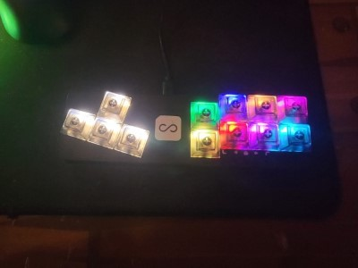
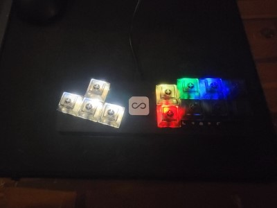
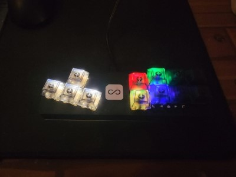
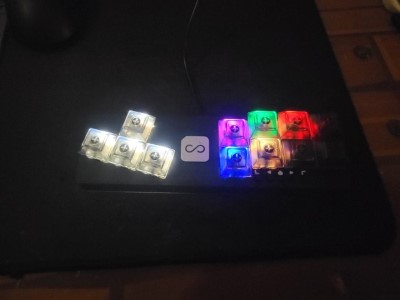

# Fightboard Hybrid Firmware

Custom firmware for the [Fightboard](https://www.etsy.com/listing/786877857/fightboard) and [Fightboard MX](https://www.etsy.com/listing/845376230/fightboard-mx) by [thnikk](https://www.etsy.com/people/thnikk), supporting XInput and Nintendo Switch.

## Introduction

The stock Fightboard firmware supports XInput and a bunch of extra features like profiles, remapping buttons, setting LEDs, etc. Well...this firmware has none of that and is instead focused on performance and enhancing system compatibility. It currently supports XInput (PC, Android, Raspberry Pi) and Nintendo Switch modes.

## Installation

> NOTE: Any saved configuration will be cleared when reflashing the controller!

An update package is provided that uses PowerShell and a bundled version of avrdude to handle flashing the microcontroller in the Fightboard. If you're familiar with this process or on Linux/Mac, you can just extract the `.hex` file and flash it manually.

**Using the Update Script**:

Follow these steps to update your firmware:

1. Download and extract the latest firmware update package from [Releases](https://github.com/FeralAI/FightboardHybrid/releases).
1. Press the reset button twice quickly on the bottom of your Fightboard. You'll need a small screwdriver or toothpick to press it. This will put the microcontroller into bootloader mode for about 10 seconds.
1. Run the `update.bat` file from the extracted firmware update folder. Make sure you do this within a few seconds of resetting the board otherwise it will fail.

**Manual Installation**:

You will need `avrdude` for your platform and the COM port of your board when in bootloader mode. Run the following command, replacing `$port` with your COM port (COM10 for example). Have this command ready and run it right after resetting into bootloader mode with the double press:

    ```sh
    avrdude -v -Cavrdude.conf -patmega32u4 -cavr109 -P $port -b57600 -D -Uflash:w:Fightboard.ino.hex:i
    ```

That's it! If all went well you should see a success message at the end like `avrdude.exe: 15206 bytes of flash verified` and `avrdude.exe done.  Thank you.` If you have issues, try running through the steps again or [opening an issue](https://github.com/FeralAI/FightboardHybrid/issues/new).

## Usage

### Button Layout

The Fightboard uses a standard 8-button fightstick layout. To make things easy, any references to these buttons will use the `Generic` labels in this documentation.

**Generic:**

```text
P1 P2 P3 P4
K1 K2 K3 K4
```

**XInput**:

```text
X Y RB LB
A B RT LT
```

**Switch**:

```text
Y X  R  L
B A ZR ZL
```

### Input Modes

To change the input mode, **hold one of the following buttons as the controller is plugged in:**

* **`SELECT`** for Nintendo Switch
* **`START`** for XInput

Input mode is saved across power cycles.

### D-Pad Modes

You can switch between the 3 modes for the D-Pad **while the controller is in use by pressing one of the following combinations:**

* **`SELECT + START + UP`** - D-Pad
* **`SELECT + START + LEFT`** - Emulate Left Analog stick
* **`SELECT + START + RIGHT`** - Emulate Right Analog stick

D-Pad mode is saved across power cycles.

### LED Modes

By default, the controller will use an Xbox color scheme for XInput and a Super Famicom color scheme for Switch mode. You can also override the color scheme by **holding the following button(s) as the controller is plugged in:**

| LED Effect/Layout | Button(s) | Preview |
| :---------------- | :-------: | :-----: |
| Xbox | P1 |  |
| Super Famicom | P2 |  |
| Six Button Fighter (SF and KI) | P3 |  |
| Guilty Gear Type-A | P4 |  |
| Neo-Geo Straight | K1 |  |
| Neo-Geo Curved | K2 |  |
| Neo-Geo Modern (2x2 layout) | K3 |  |
| Guilty Gear Custom (my layout) | K4 |  |
| Static Rainbow | P1 + P2 + P3 + P4 |  |

The overridden LED mode will be saved across power cycles, and **can be cleared by holding `R3` when plugging the controller in.**

## TODO List

* [x] XInput support
* [x] Switch support
* [x] Add LED support
* [x] Create install package
* [ ] Review button state logic
* [ ] Optimize HID report construction
* [ ] Break apart XInput and Switch USB code
* [ ] Document development setup

## Acknowledgments

I'd like to thank [Jack Reitano, a.k.a. thnikk on Etsy](https://www.etsy.com/people/thnikk), the creator of the Fightboard controllers. It's great he used common Arduino parts, and he was also kind enough to provide me some support while making this.

As for code, the base of this project was adapted from [CrazyRedMachine's LUFAHybridFightstick](https://github.com/CrazyRedMachine/LUFAHybridFightstick), which was based on [fluffymadness' ATMega32U4-Switch-Fightstick](https://github.com/fluffymadness/ATMega32U4-Switch-Fightstick) and [bootsector's XInputPadMicro](https://github.com/bootsector/XInputPadMicro). There's not a whole lot of the original sketch left, but a lot of the glue is still here and it was a great starting off point.
